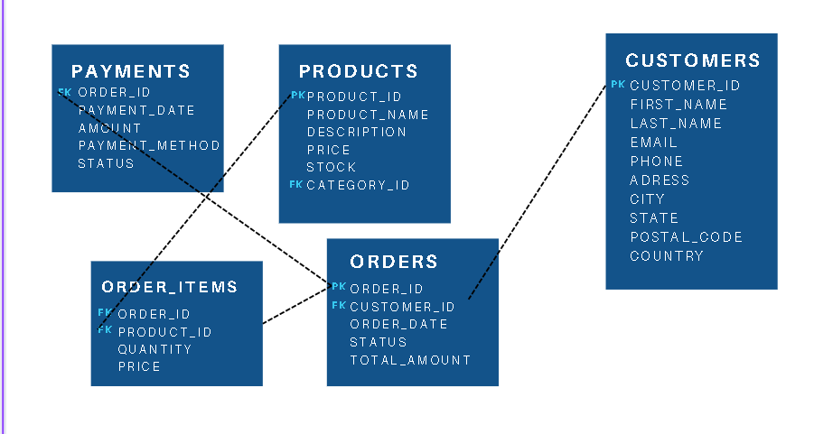

1. **Entity-Relationship Diagram**:
https://www.canva.com/design/DAGecNJl1Jw/w6F1NQoRhkbAgOWaF2cyNg/edit?utm_content=DAGecNJl1Jw&utm_campaign=designshare&utm_medium=link2&utm_source=sharebutton

2. **Insights and Observations**:
its a simple database for orders managment along wiith costumers and peoducts, like an a small ecom business, tables are products, orders, payments, order_items (on to many), and custumenrs 

its noted thet there is a missing table ctegories and all others are good to go .

### **4. Analyze Table Data**
- Determine the number of rows in each table.
Select count(*) from Table_name;

- Total number of orders in the system.
select sum(total_amount) from orders;

- The most expensive product.
select product_name from products order by price desc limit 1;

- Total revenue from all orders.

- The customer who has placed the most orders.
select first_name from customers where customer_id in (select sum() from)

